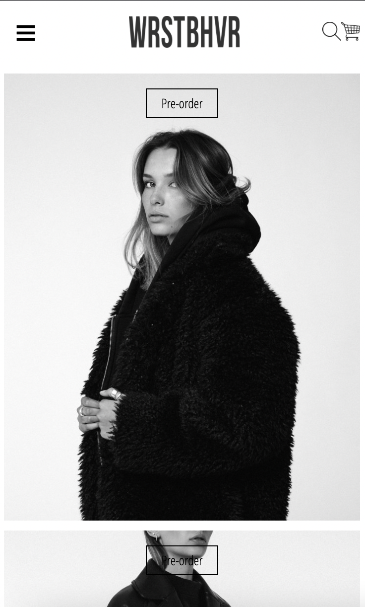
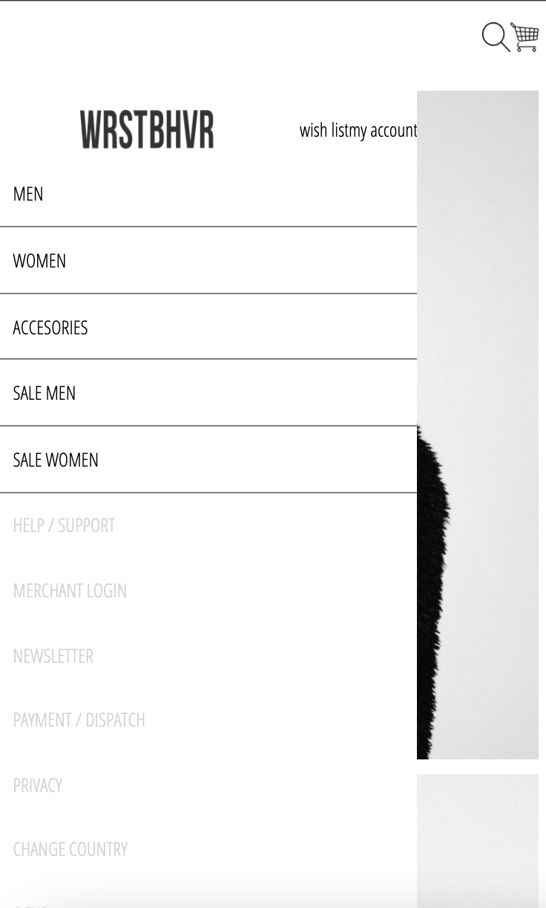
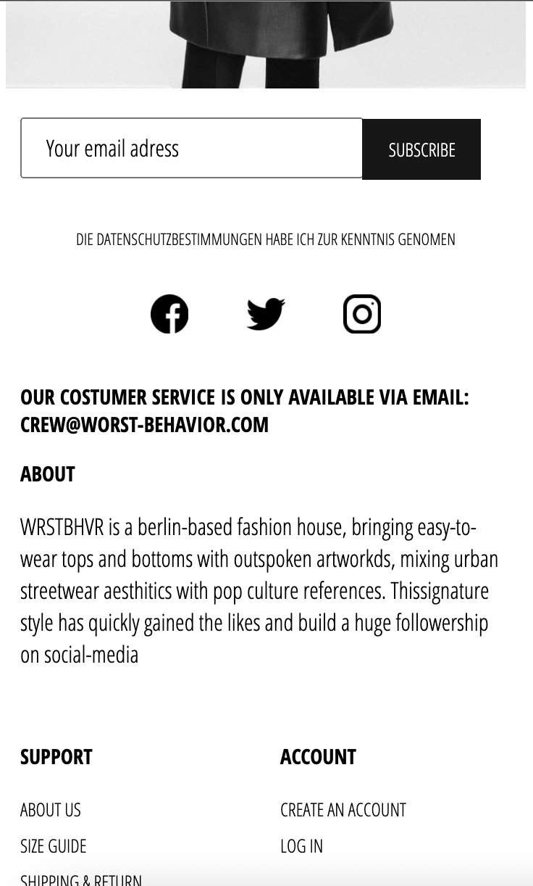
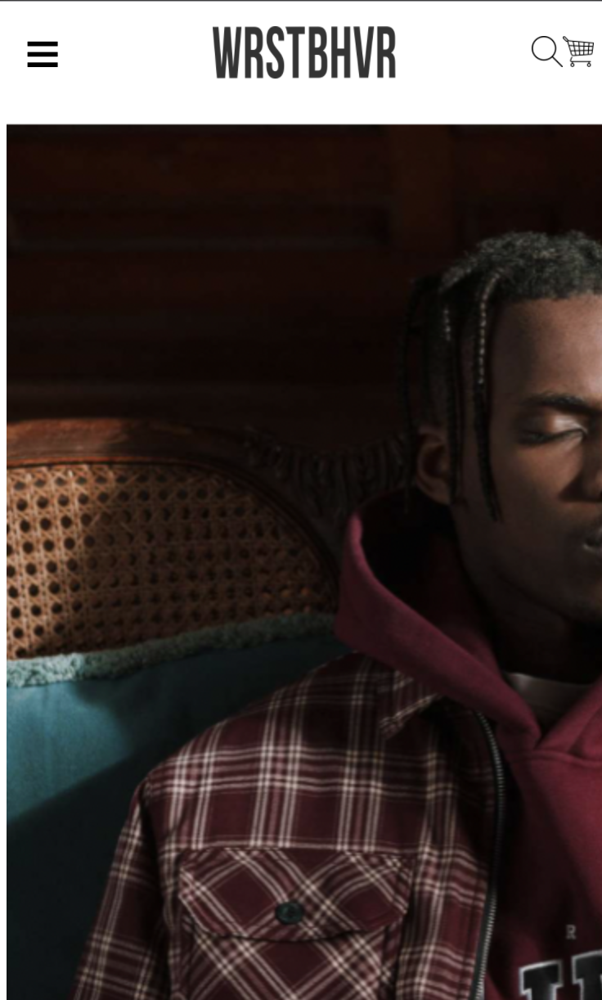
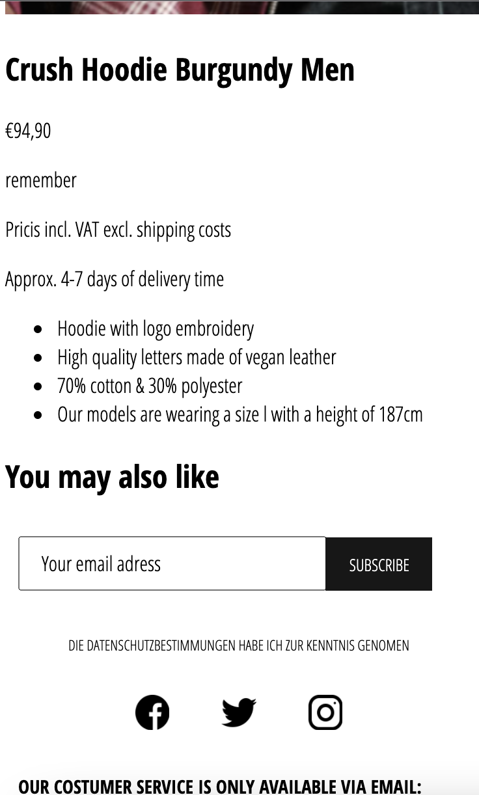
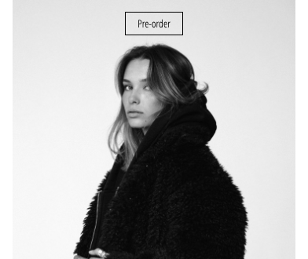
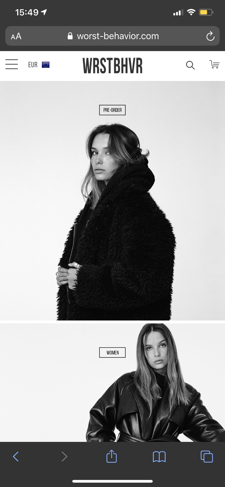
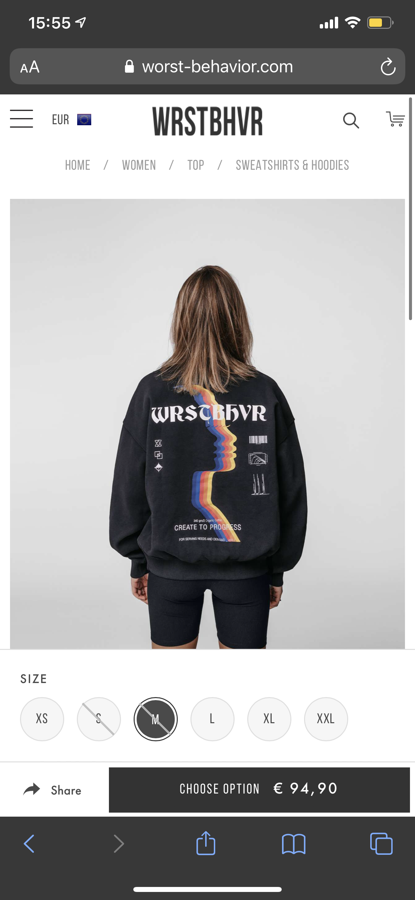

# Procesverslag
**Auteur:** Onika Schroder

Markdown cheat cheet: [Hulp bij het schrijven van Markdown](https://github.com/adam-p/markdown-here/wiki/Markdown-Cheatsheet). Nb. de standaardstructuur en de spartaanse opmaak zijn helemaal prima. Het gaat om de inhoud van je procesverslag. Besteedt de tijd voor pracht en praal aan je website.

## Bronnenlijst
1. Veel MDN
2. Stack overflow
3. css-tricks (flexbox)
4. Opdrachten uit de les

## Eindgesprek (week 7/8)

Ik heb mijn eindproduct helaas niet afgekregen. Wat ik goed vond gaan is dat ik merk dat ik er steeds handiger in word. Het lukt mij nu sneller en makkelijker hoe ik iets specifieker moet opzoeken als ik er niet uitkom.
En ik merk dat ik er veel plezier in heb tijdens het maken (vooral als het werkt) 

Wat minder goed ging was mijn planning met mijn huidige vakken, vandaar dat het mij niet is gelukt om het af te krijgen. 

Wat ik nog moet toevoegen/volledig maken:
Home pagina
- het hamburger menu
    - de pagina moet opzij schuiven
    - logo, wishlist, account moet juist staan
    - change country en €EUR
- Betaalmethodes toevoegen in de footer

Productpagina
- tekst en titels juist stylen
- slideshow toevoegen bij 'you may also like'

- Alt teksten toevoegen
- Toeters en bellen toevoegen
    - Popups 
    - selected state

**Screenshot(s):**

## Voortgang 3 (week 6)

Wegens persoonlijke omstandigheden was ik hierbij niet aanwezig.

## Voortgang 2 (week 5)

### Stand van zaken
Ik ben goed opweg met de styling van header & footer, die op beide pagina's hetzelfde zijn. De transitie van het menu is af. Er moet wel nog content aan worden toegevoegd en hoe de huidige pagina eruit ziet als het menu opengeklapt is. 

**Screenshot(s):**

### Agenda voor meeting

### Verslag van meeting

## Voortgang 1 (week 3)

### Stand van zaken

Homepagina
- Klaar met html
 
- Begonnen met de css van de homepagina
 
- Het is me gelukt om de buttons in de images goed te stylen. 
 

Productpagina
- Begonnen met html

**Screenshot(s):**

Hier is het me gelukt met position: relative, om de buttons gestyled in de foto te plaatsen

### Agenda voor meeting

-samen met je groepje opstellen-

Ik zou graag willen bespreken hoe je een hamburger menu maakt. 

### Verslag van meeting

-H3 uit UL
-object-fit: contain op alle images in header
 </img>
-ul andersom
-goeie html tot nu toe, ee
-sanne, heeft  hamburgermenu toelichting gegeven
-search.png: er een button van maken met als background die zoek image
-button in image, moet een link zijn en geen button, dus <a>
-border toevoegen bij het maken. 
 </img>
- hamburger menu zijn ook linkjes en geen 

## Breakdownschets (week 1)

Breakdown schets van de homepagina
</img>

## Intake (week 1)

**Je startniveau:** rood / (heel klein beetje zwart door gevolgde vakken en themasemester)

**Je focus:** responsive

**Je opdracht:** https://worst-behavior.com/

**Screenshot(s) van de eerste pagina (small screen):**

-homepagina-

**Screenshot(s) van de tweede pagina (small screen):**

-productpagina-

Hamburger menu slides:
https://codemyui.com/pure-css-hamburger-menu-slide-in/
https://csspoint101.com/40-best-css-sliding-menus/
